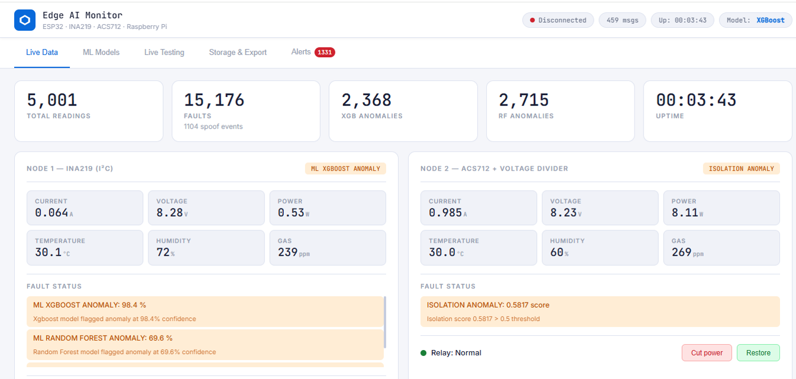
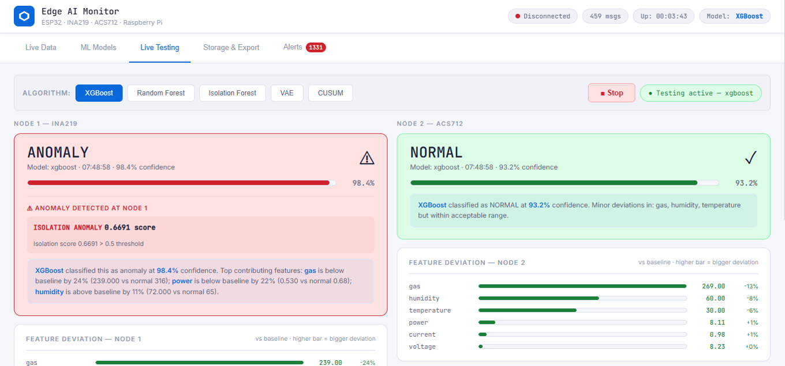
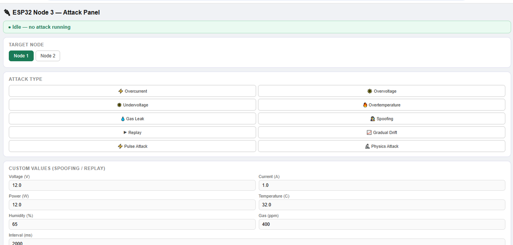
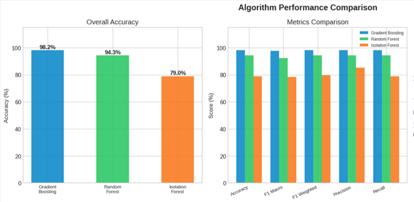
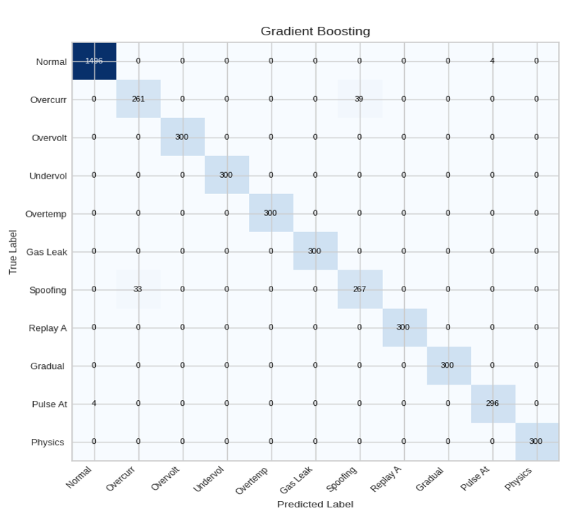

# 🚀 Real-Time Fault Detection and Cyber Attack Classification in IoT Sensor Nodes Using Edge AI

An IoT Edge AI system that performs **real-time fault detection and cyber attack classification** using ESP32 sensor nodes, Raspberry Pi 4, MQTT communication, and Machine Learning.

The system continuously monitors electrical parameters, detects genuine faults and cyber attacks, automatically isolates faulty nodes using relays, and visualizes everything through a Flask-based web dashboard.

---

# 📖 Project Overview

Traditional cloud-based monitoring introduces latency and network dependency.

This project performs **real-time edge inference** directly on a Raspberry Pi using trained Machine Learning models.

The system consists of:

- ESP32 Node 1 (INA219 Sensor Node)
- ESP32 Node 2 (ACS712 Sensor Node)
- ESP32 Node 3 (Attack Generator)
- Raspberry Pi 4 Edge Server
- MQTT Broker
- Flask Dashboard
- Dual Machine Learning Models

---

# 🛠 Hardware Components

- Raspberry Pi 4
- ESP32 DevKit V1 (3 Nodes)
- INA219 Current Sensor
- ACS712 Current Sensor
- DHT11 Sensor
- MQ135 Gas Sensor
- Relay Modules
- LEDs
- Active Buzzer
- Breadboards
- Battery Pack

---

# 🖼 Final Hardware Setup

The complete experimental setup consisting of two sensing nodes, one attacker node, Raspberry Pi communication, relay modules, sensors, and power supply.


---

# 🖥 Live Monitoring Dashboard

Real-time monitoring dashboard displaying

- Live sensor readings
- Relay status
- ML predictions
- Fault status
- MQTT communication



---

# 🤖 Machine Learning Classification

Displays

- Confidence score
- Feature deviation
- Predicted class
- Model explanation



---

# 🚨 Alert Dashboard

Stores every detected

- Genuine fault
- Cyber attack
- Isolation event


---

# 🎯 Attack Injection Panel

ESP32 Node 3 injects

- Overcurrent
- Overvoltage
- Undervoltage
- Temperature Fault
- Gas Leak
- Spoofing
- Replay
- Drift
- Pulse Attack
- Physics Attack



---

# 📈 Model Performance

Performance comparison of

- Gradient Boosting
- Random Forest
- Isolation Forest



---

# 📊 Algorithm Comparison


---

# 📉 Confusion Matrix

Gradient Boosting confusion matrix.



---

# ⭐ Features

- Real-time MQTT communication
- Edge AI inference
- Dual Machine Learning models
- 11-class fault classification
- Cyber attack detection
- Automatic relay isolation
- Buzzer alerts
- SQLite database
- CSV export
- Dashboard analytics
- Live attack simulation

---

# 📂 Project Structure

```text
EDGEAI_PROJECT/
│
├── app.py
├── config.py
├── feature_engine.py
├── inference_engine.py
├── mqtt_handler.py
├── gpio_controller.py
├── gradient_boosting.py
├── random_forest.py
├── generate_dataset.py
├── compare_models.py
├── firmware/
├── saved_models/
├── images/
└── docs/
```

---

# 🧠 Machine Learning Models

| Model | Accuracy |
|--------|----------|
| Gradient Boosting | 97.78% |
| Random Forest | 94.29% |
| Isolation Forest | 79% |

---

# ⚙ Technologies Used

## Hardware

- ESP32
- Raspberry Pi
- INA219
- ACS712
- MQ135
- DHT11
- Relay Module

## Software

- Python
- Flask
- MQTT
- SQLite
- HTML
- CSS
- JavaScript

## Machine Learning

- Gradient Boosting
- Random Forest
- Isolation Forest
- Scikit-Learn
- XGBoost

---

# 🚀 Installation

```bash
git clone https://github.com/yourusername/EdgeAI-Fault-Detection.git

cd EdgeAI-Fault-Detection

pip install -r requirements.txt

python app.py
```

---

# 📊 Results

- 11-class fault classification
- Real-time monitoring
- Live dashboard
- Automatic relay control
- Cyber attack simulation
- Edge AI inference

---

# 👨‍💻 Author

**Naveen Kumar**

M.Tech Embedded Systems

Amrita Vishwa Vidyapeetham

